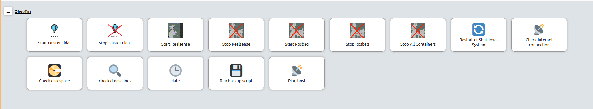

[](https://github.com/bjoernellens1/go1-ros/actions/workflows/docker-buildx-bake-build.yml)

# GO1-ROS - Noetic Branch

## CPS Docker Workspace for Unitree GO1 ROS Development

### Introduction

This repository contains all the necessary code to start developing ROS packages for the Unitree GO1 quadruped robot using Docker. Docker simplifies running different ROS environments on modern operating systems and provides a safe environment to run code on GO1 hardware (Jetson Nano, Raspberry Pi) without heavily modifying the base system, which uses an arm64 architecture.

### Table of Contents
- [Setup](#setup)
    - [Prerequisites](#prerequisites)
    - [Install Docker](#install-docker)
    - [Network Configuration](#network-configuration)
    - [Pulling Docker Images](#pulling-docker-images)
    - [Building Docker Images Locally](#building-docker-images-locally)
- [Information](#information)
    - [Understanding Docker Image Builds](#understanding-docker-image-builds)
    - [GitHub Workflows and GHCR](#github-workflows-and-ghcr)
- [Using the Robot](#using-the-robot)
  - [OliveTin Web User Interface](#olivetin-web-user-interface)
- [Services Overview](#services-overview)
- [Docker Compose Configuration](#docker-compose-configuration)

### Setup
### Prerequisites

Ensure you have the following installed:
- Docker
- Docker Compose
- An Intel or NVIDIA GPU (optional, for GPU support)
- ~~An X11 server running on your host machine~~

### Install Docker

To install Docker, follow the instructions on the official Docker website: [Docker Installation](https://docs.docker.com/get-docker/).

For Ubuntu, you can use these commands:
```sh
curl -fsSL https://get.docker.com -o get-docker.sh
sudo sh get-docker.sh
```

Then, allow your user to access Docker without `sudo`:
```sh
sudo usermod -aG docker $USER
newgrp docker
```

### Network Configuration

Refer to the GO1 networking diagram for details on network setup:


### Pulling Docker Images

The Docker images are built automatically via GitHub workflows and are available on GitHub Container Registry (GHCR). To pull these images, use:

```sh
docker compose pull
```
### Building Docker Images Locally

If you need to build the Docker images locally, use the following commands:

```sh
docker buildx bake --load
```
### Test Docker Services

Start a service:
```sh
docker compose up -d >service_name<

```

Enter the ROS shell:
```sh
docker compose run guis
```

Or start RViz:
```sh
docker compose run guis rviz
```

### Additional First Steps on the go1-pc:
Some additional setup is needed on the PC to enable all features for remote supervision. The necessary scripts are included in the init/ folder. To run them, use the following commands:

```sh
cd init
./run_all.sh
```

### Information
### Understanding Docker Image Builds

Docker images are built using `Dockerfile`s which define the environment and the steps required to set up the software inside the container. The `docker buildx bake` command allows for concurrent builds, making the process more efficient. For more information on Docker builds, visit the [Docker Build Documentation](https://docs.docker.com/engine/reference/commandline/build/).

### GitHub Workflows and GHCR

GitHub workflows automate the process of building and deploying Docker images. In this repository, a GitHub workflow is set up to build the Docker images and push them to the GitHub Container Registry (GHCR). GHCR is a service provided by GitHub for hosting container images. For more information on GitHub workflows and GHCR, visit:
- [GitHub Actions Documentation](https://docs.github.com/en/actions)
- [GitHub Container Registry Documentation](https://docs.github.com/en/packages/working-with-a-github-packages-registry/working-with-the-container-registry)

### Using the Robot

#### OliveTin Web User Interface

The OliveTin web user interface allows for easy management of the Docker Compose services and the system itself. It is hosted on `go1-pc:1337/`. With OliveTin, you can:
- Start the Docker Compose services
- Stop the Docker Compose services
- Reboot/Shutdown the go1-pc



To access OliveTin, when you are connected to the robot network, open a web browser and navigate to `http://go1-pc.local:1337/`.

### Services Overview

#### Base Service (`base`)

The `base` service includes all necessary dependencies for running ROS, such as:
- ROS installation
- Networking and IPC settings for ROS communication
- X11 configuration for GUI applications
- NVIDIA GPU support

#### Overlay Service (`overlay`)

The `overlay` service builds on the `base` service by adding project-specific source code, allowing you to develop and run your ROS projects within the Docker environment.

#### GUI Service (`guis`)

The `guis` service extends the `overlay` service to include additional dependencies for GUI applications, useful for running graphical ROS tools.

#### ROS1 Bridge Service (`ros1bridge`)

The `ros1bridge` service sets up a bridge between ROS1 and ROS2, facilitating communication between ROS1 and ROS2 nodes.

#### ROS1 Roscore Service (`roscore`)

The `roscore` service runs the `roscore`, the central node in a ROS1 system, handling the naming and registration of ROS nodes.

### Docker Compose Configuration

The `Dockerfile` defines the images for each service, setting up base dependencies, project overlays, and GUI dependencies.